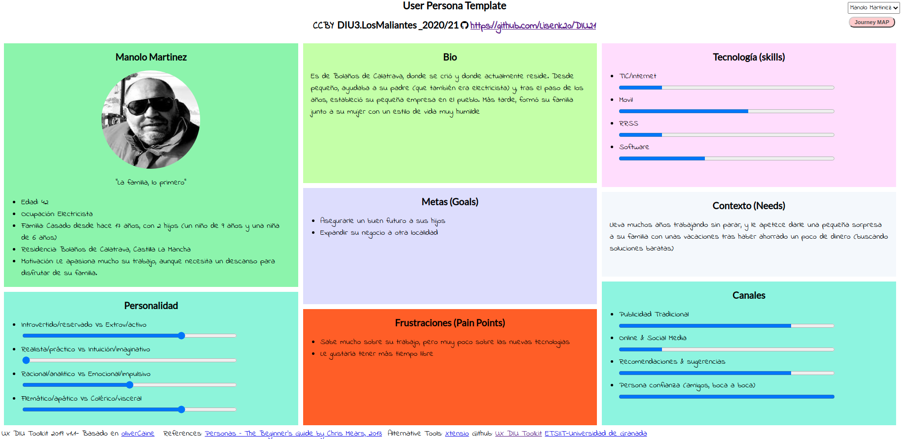
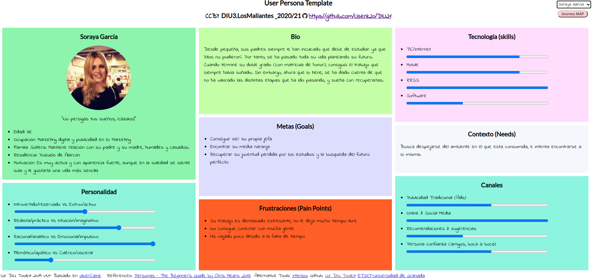
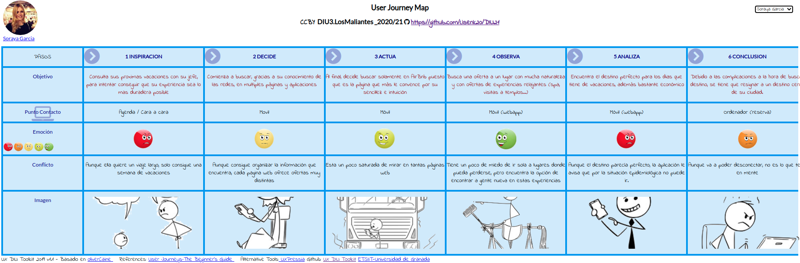

## DIU - Practica1, entregables

- Desk research: Análisis Competencia

  -  
- 2 Personas 

  - Manolo Martinez:
  - Soraya García:
- 2 User Journey Map  (1 por persona)

  - Manolo Martinez:
  - Soraya García: 
- Revisión de Usabilidad: https://github.com/Lisenk20/DIU21/blob/master/P1/Usability-review-DIU3-LosMaliantes.pdf

- Valoración y conclusiones de esta etapa:
  - Tras analizar AirBnb y compararla con sus competidores más famosos, consideramos que esta etapa nos ha ayudado a ver el diseño y concepto de estas aplicaciones y páginas web de una forma distinta, buscando la comodidad y la facilidad de todos los tipos de usuario que puedan existir. Sin duda, es una experiencia necesaria para poder llevar a cabo nuevos proyectos y aprender de los errores y aciertos de otros proyectos famosos.