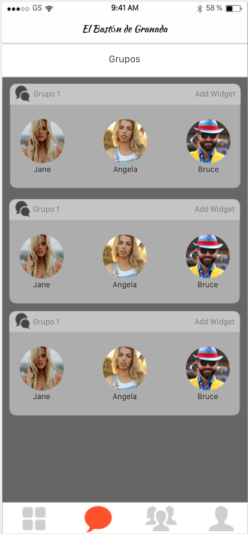
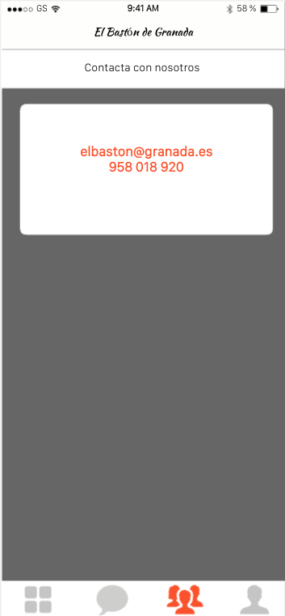

## DIU - Practica2, entregables

### Ideación 
* Malla receptora de información:
  * 

### PROPUESTA DE VALOR
* ScopeCanvas
  * 

### TASK ANALYSIS

* User/Task flow
  * 

### ARQUITECTURA DE INFORMACIÓN

* Sitemap 

  * 

* Labelling 

  |     Label      |                          Scope note                          |
  | :------------: | :----------------------------------------------------------: |
  |     Rutas      | Lleva a la página donde puedes visualizar todas las rutas disponibles (se accede mediante la busqueda de la pagina principal) |
  |      Ruta      | Lleva a la información de la ruta y a la valoración de otros usuarios (se accede al interactuar con una ruta) |
  |     Grupos     | Lleva al menú donde puedes ver los grupos que tienes con otros usuarios y acceder al chat (Icono: globo de comic) |
  |      Chat      | Chat de usuarios de un grupo (se accede al interactuar con uno de los grupos) |
  |     Perfil     | Lleva a la información del perfil del usuario (Icono: usuario) |
  | Sobre nosotros | Lleva a la página de información de la empresa (icono: grupo) |
  |  Contáctanos   | Lleva a la página de contacto con la empresa (se accede al pulsar el botón de Contáctanos) |

### Prototipo Lo-FI Wireframe 

- Página principal: 

- Rutas: 

  

  

- Rutas: 

  

  

- Grupos: 

  

- Chat:

  

  

- Perfil: 

  

  

- Sobre nosotros: 

  

- Contáctanos:

  

### Conclusiones  
Durante esta etapa, hemos conseguido darle forma a nuestro proyecto y, mediante los pasos especificados en el guión de prácticas, realizarlo de una forma sencilla y que nos permite estructurar nuestras ideas. Nos ha servido de mucho esta práctica para empezar los primeros pasos de nuestro proyecto, y conseguir ideas para mejorarlo en las siguientes prácticas.