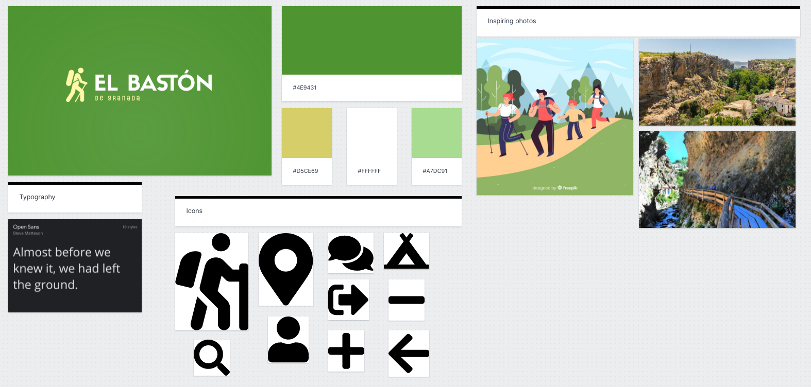
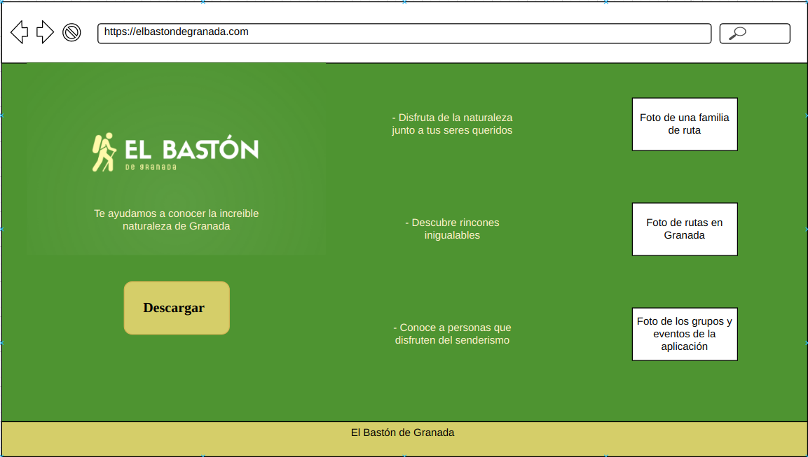
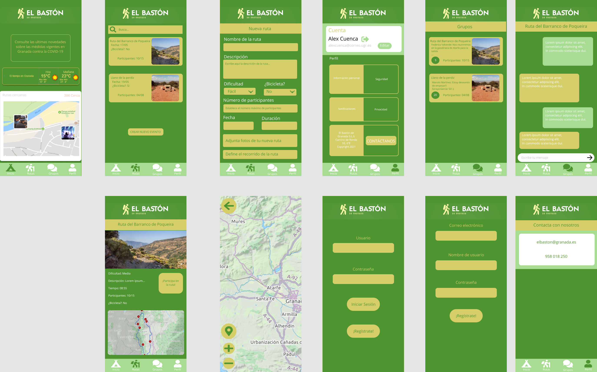

# DIU - Practica 3, entregables

## Moodboard (diseño visual + logotipo)   

Hemos diseñado el logotipo con la herramienta XXXXX, teniendo en cuenta los colores elegidos para el diseño y la armonización con el resto del proyecto. Debido a la estructura del logotipo, creemos que éste sí se podría llegar a usar como encabezado de Twitter, por ejemplo.

## Landing Page

## Mockup: LAYOUT HI-FI

El Mockup lo hemos diseñado con la herramienta Figma, ya que nos permitía realizar una demo de nuestra aplicación en funcionamiento para mostrarla en el Case Study.

## Documentación: Publicación del Case Study

(incluye) Valoración del equipo sobre la realización de esta práctica o los problemas surgidos
 
