# DIU21
Prácticas Diseño Interfaces de Usuario 2020-21 (Tema: Turismo) 

Grupo: DIU3_LosMaliantes.  Curso: 2020/21 
Updated: 12/5/2021

Proyecto: 
>>> El Bastón de Granada.

Descripción: 

>>> App para moviles destinada a su uso para conocer y disfrutar de las distintas rutas de senderismo que ofrece la ciudad de Granada y sus alrededores. Con ella,
>>> los usuarios van a tener la oportunidad de crear rutas y participar en otras creadas por otros usuarios, pudiendo asi socializar y conocer nuevas personas mientras se disfruta de un ocio sano y seguro (respetando todas las medidas contra la COVID-19). Además, podrán chatear con sus compañeros de ruta mediante chats grupales disponibles en cada evento. 

Logotipo: 

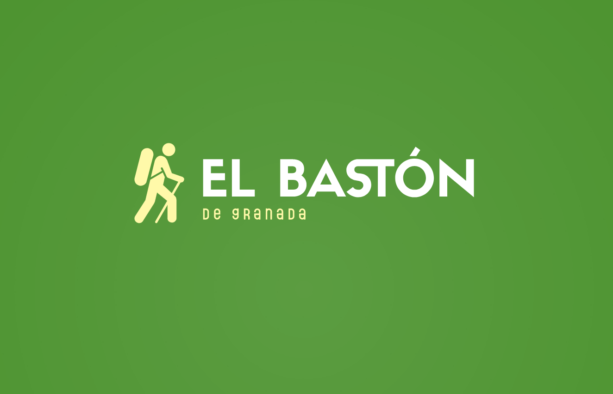

Miembros
 * :bust_in_silhouette:   Alejandro Cuenca Zurita     :octocat:     
 * :bust_in_silhouette:  José Escribano Cobalea     :octocat:

-----

# Proceso de Diseño 

## Paso 1. UX Desk Research & Analisis 

 1.a Competitive Analysis
-----

>>> Nuestra aplicación seleccionada ha sido **‘Airbnb’**. Tras investigar múltiples aplicaciones y páginas web que ofrecen oportunidades de ocio a sus usuarios (respetando las medidas pertinentes por la situación epidemiológica actual), hemos considerado que Airbnb es una candidata perfecta por su completitud y diseño. 
>>>
>>> Esta página, además de ofrecernos distintas experiencias en el lugar y la fecha que nosotros escojamos, nos ofrece posibilidades de encontrar alojamiento (muy económico) en el lugar que deseemos, pudiendo así poder hacer ocio en lugares que no hayamos llegado a conocer y además poder residir en ese lugar varios días (para combinar varias experiencias en un periodo corto de tiempo).
>>>
>>> Sin embargo, esta página tiene distintos competidores (Trivago, Booking y TripAdvisor, entre otros) que ofrecen servicios parecidos a nuestra aplicación. 
>>>
>>> Respecto a **Trivago**, esta aplicación sirve como una comparadora de precios entre distintas páginas y aplicaciones (incluido los sitios webs de las propias experiencias), para ayudarnos a encontrar la que se ajuste más a nuestro presupuesto permitido.
>>> **Booking** es una aplicación que nos permite buscar y reservar experiencias y alojamientos en el lugar y fecha indicados.
>>>
>>> **TripAdvisor**, al igual que Booking, nos permite buscar y reservar alojamientos en el lugar al que deseamos ir.
>>>
>>> Por tanto, hemos realizado un análisis competitivo entre nuestra aplicación y las competidoras que hemos seleccionado. A continuación, adjuntamos el resultado:
>>>
>>> 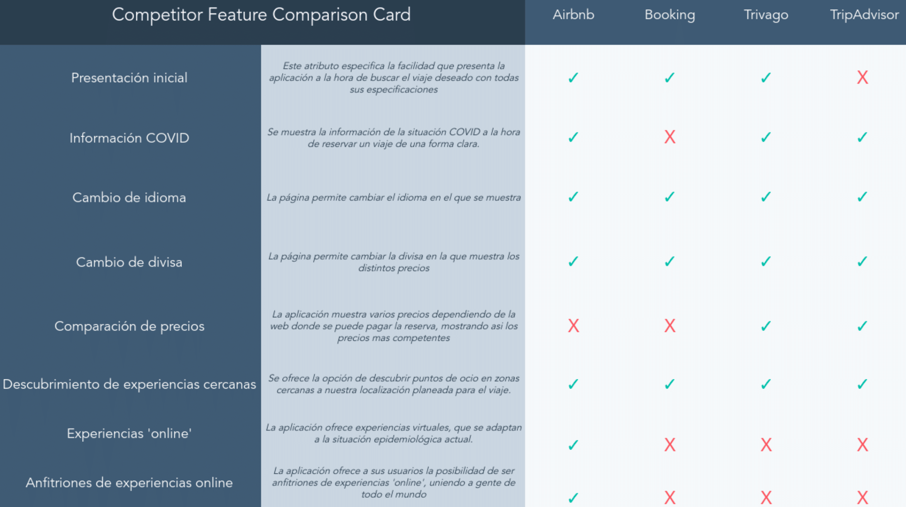

 1.b Persona
-----

>>> 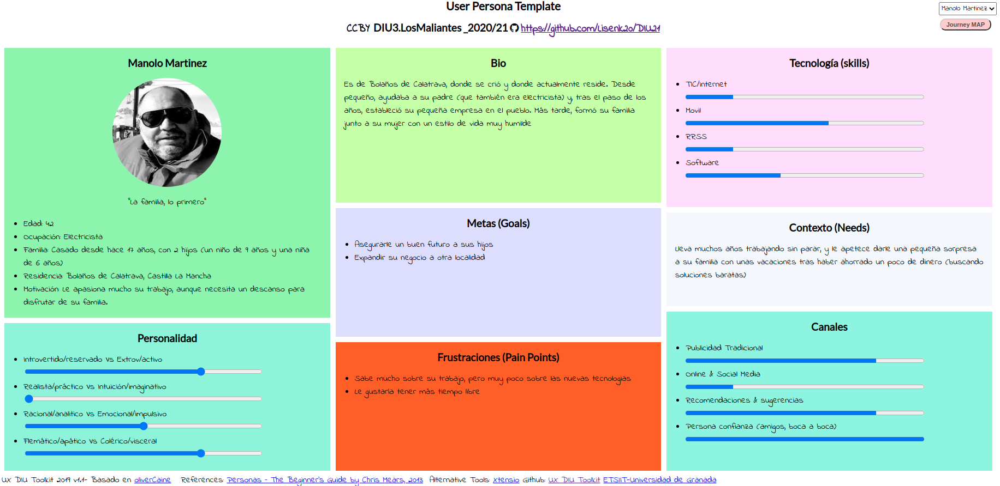
>>>
>>> En primer lugar, nos ha parecido interesante proponer a una persona con pocas habilidades con la tecnología, que no se fía mucho de realizar reservas por Internet, y que es una persona sencilla que quiere disfrutar de algunas experiencias nuevas junto a su familia.
>>>
>>> Así, podremos ver si la aplicación es intuitiva y de fácil uso para personas inexpertas.
>>>
>>> 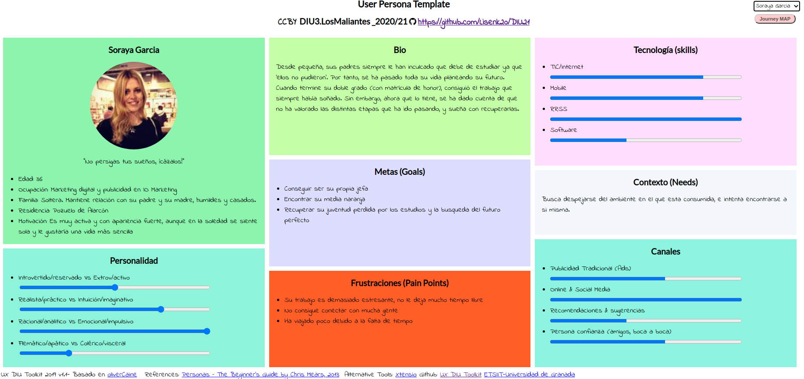
>>>
>>> Para la segunda persona, hemos decidido crear a Soraya, una mujer joven y soltera que se maneja bien con las nuevas tecnologías y las redes sociales, para comprobar si nuestra aplicación cumple las expectativas de una persona que, aún teniendo soltura buscando experiencias en Internet, sigue eligiendo Airbnb.

 1.c User Journey Map
----

>>> 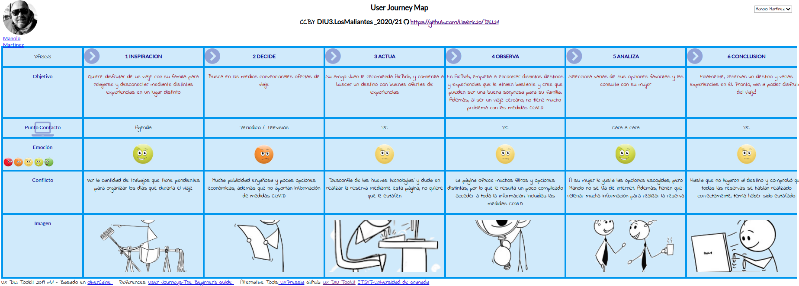
>>>
>>> Para Manolo Martinez (quien intentaba buscar como hacer su viaje mediante publicidad convencional), descubrir Airbnb le ayudó para poder realizar la reserva de su experiencia junto a su familia. Sin embargo, desconfía de Internet y de las nuevas tecnologías, afectando a su proceso.
>>>
>>> 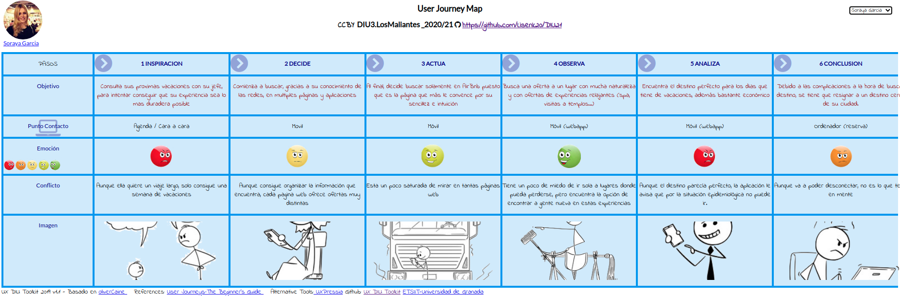
>>>
>>> Para Soraya Garcia, las tecnologías no le han supuesto mucho problema. Aunque su jefe no le dió los días que deseaba para vivir su experiencia, había encontrado su “viaje perfecto”. Sin embargo, debido a la situación epidemiológica actual, no pudo completar su reserva y decidió, con descontento, recurrir a otro destino más adecuado.

 1.d Usability Review
----
>>>  
>>>
>>>  - Enlace al documento:  https://github.com/Lisenk20/DIU21/blob/master/P1/Usability-review-DIU3-LosMaliantes.pdf
>>>
>>>  - Valoración final (numérica): 86 - Good
>>>  - Comentario sobre la valoración:  En general, la aplicación de Airbnb es capaz de ofrecer una buena experiencia de usuario, destacando su página principal con una interfaz muy clara e intuitiva. En cuanto a los aspectos negativos, encontramos una escasa ayuda en línea así como pocas instrucciones de uso de la plataforma, aunque no tenemos fallos graves en cuanto a la usabilidad.

## Paso 2. UX Design  

 2.a Feedback Capture Grid / Empathy map / POV
----

>>> 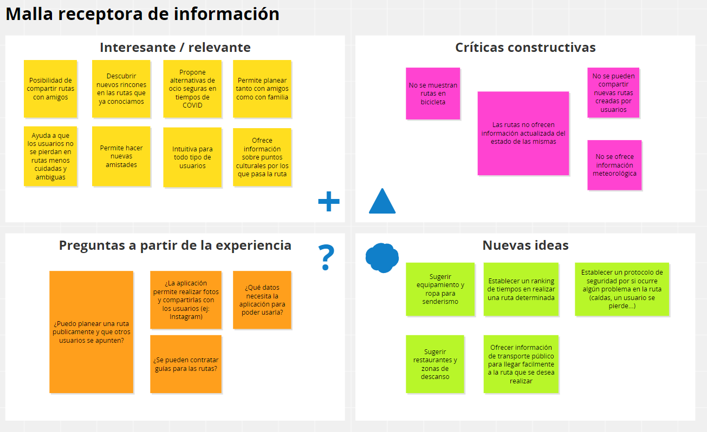

>>> La malla receptora de información nos ayuda a agrupar nuestras ideas, viendo los pros y los contras de las mismas, para poder conseguir que nuestro proyecto tenga una evolución clara y planeada. Para ello, nos preguntamos los puntos interesantes y las criticas constructivas que pueden surgir de nuestra idea inicial, además de conseguir preguntas y nuevas ideas de otros usuarios que nos ayudarán a plantearnos nuevas opciones para el proyecto.

 2.b ScopeCanvas
----
>>> 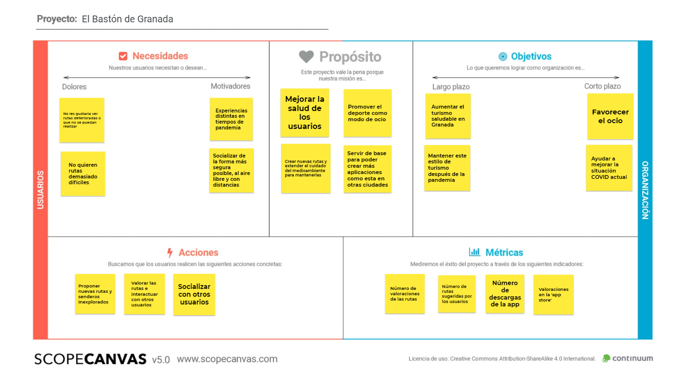En este punto, estudiamos las necesidades y acciones de nuestros usuarios, además de los objetivos y las métricas que debemos seguir como organización para concienciarnos de que el proyecto funciona como esperamos y que lleve una evolución consigo. Además, es muy importante tener en cuenta el proposito de El Bastón de Granada, siendo estos los pilares que conseguirán que el proyecto se mantenga. 

 2.b Tasks analysis 
-----

>>> 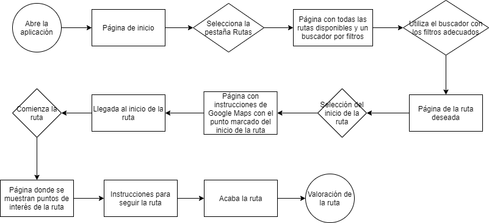
>>>
>>> Para identificar las tareas (y la relevancia para los usuarios), hemos decidido realizar un
>>> Task Flow. Con él, somos capaces de observar el camino que toma un usuario para
>>> conseguir un objetivo concreto dentro de nuestra aplicación. Hemos elegido realizar el Task Flow porque queríamos hacer hincapié en el task más importante de la App, ya que en nuestro sistema no hay tantas tareas importantes como para realizar la matriz de tareas, y así, como hemos dicho, recalcamos la tarea de realizar una ruta. En nuestro caso, hemos creado un Task Flow que indica el camino que seguiría el usuario desde que abre la aplicación hasta que acaba una ruta y la valora.

 2.c IA: Sitemap + Labelling 
----

>>> A continuación proponemos la organización lógica de nuestra aplicación mediante un site map, con el que podremos identificar las diferentes páginas que componen a nuestro proyecto.
>>>
>>> 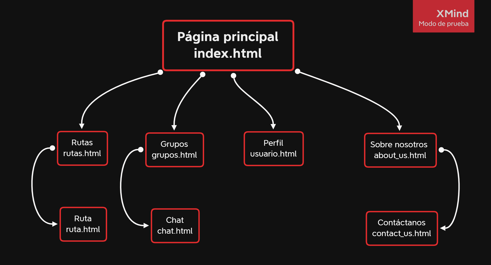
>>>
>>> |     Label      |                          Scope note                          |
>>> | :------------: | :----------------------------------------------------------: |
>>> |     Rutas      | Lleva a la página donde puedes visualizar todas las rutas disponibles (se accede mediante la busqueda de la pagina principal) |
>>> |      Ruta      | Lleva a la información de la ruta y a la valoración de otros usuarios (se accede al interactuar con una ruta) |
>>> |     Grupos     | Lleva al menú donde puedes ver los grupos que tienes con otros usuarios y acceder al chat (Icono: globo de comic) |
>>> |      Chat      | Chat de usuarios de un grupo (se accede al interactuar con uno de los grupos) |
>>> |     Perfil     | Lleva a la información del perfil del usuario (Icono: usuario) |
>>> | Sobre nosotros | Lleva a la página de información de la empresa (icono: grupo) |
>>> |  Contáctanos   | Lleva a la página de contacto con la empresa (se accede al pulsar el botón de Contáctanos) |
>>>
>>> 

 2.d Wireframes
-----

>>> - Página principal: 
>>>
>>>   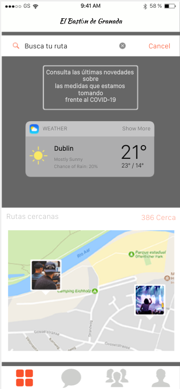
>>>
>>> 
>>>
>>> - Rutas:
>>>
>>>   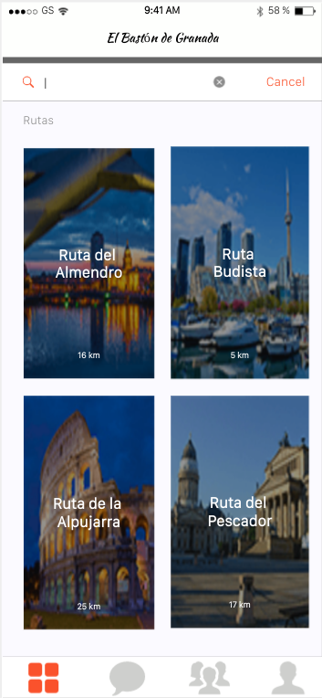
>>>
>>> 
>>>
>>> - Ruta:
>>>
>>>   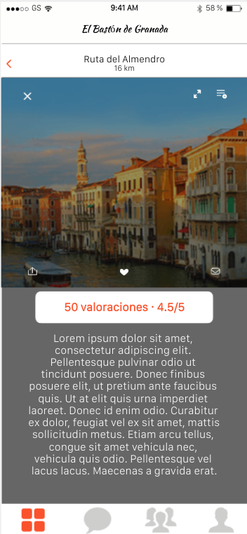
>>>
>>> 
>>>
>>> - Grupos: 
>>>
>>>   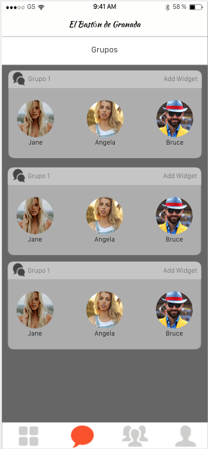
>>>
>>> 
>>>
>>> - Chat: 
>>>
>>>   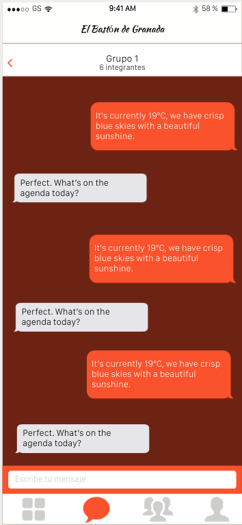
>>>
>>> 
>>>
>>> - Perfil: 
>>>
>>>   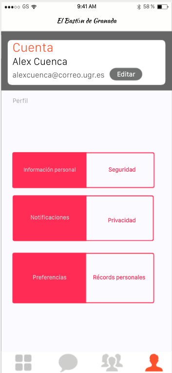
>>>
>>> 
>>>
>>> - Sobre nosotros:
>>>
>>>   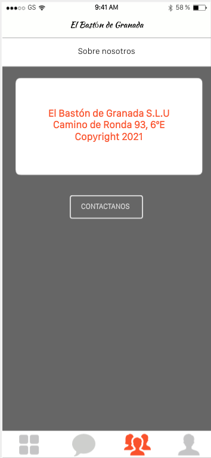
>>>
>>> 
>>>
>>> - Contáctanos:
>>>
>>>   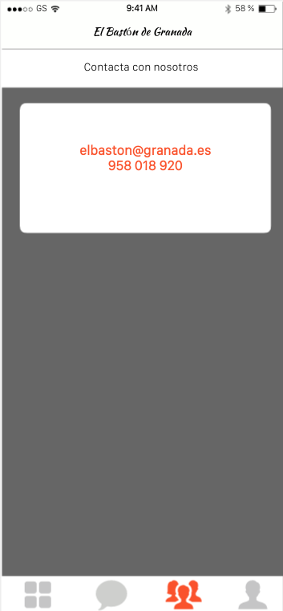

## Paso 3. Mi UX-Case Study (diseño)

 3.a Moodboard
-----

>>> Plantear Diseño visual con una guía de estilos visual (moodboard) 
>>> Incluir Logotipo
>>> Si diseña un logotipo, explique la herramienta utilizada y la resolución empleada. ¿Puede usar esta imagen como cabecera de Twitter, por ejemplo, o necesita otra?

  3.b Landing Page
----

>>> Plantear Landing Page 

 3.c Guidelines
----

>>> Estudio de Guidelines y Patrones IU a usar 
>>> Tras documentarse, muestre las deciones tomadas sobre Patrones IU a usar para la fase siguiente de prototipado. 

  3.d Mockup
----

>>> Layout: Mockup / prototipo HTML  (que permita simular tareas con estilo de IU seleccionado)

 3.e ¿My UX-Case Study?
-----

>>> Publicar my Case Study en Github..
>>> Documente y resuma el diseño de su producto en forma de video de 90 segundos aprox

## Paso 4. Evaluación 

 4.a Caso asignado
----

>>> Breve descripción del caso asignado con enlace a  su repositorio Github

 4.b User Testing
----

>>> Seleccione 4 personas ficticias. Exprese las ideas de posibles situaciones conflictivas de esa persona en las propuestas evaluadas. Asigne dos a Caso A y 2 al caso B

| Usuarios | Sexo/Edad     | Ocupación   |  Exp.TIC    | Personalidad | Plataforma | TestA/B
| ------------- | -------- | ----------- | ----------- | -----------  | ---------- | ----
| User1's name  | H / 18   | Estudiante  | Media       | Introvertido | Web.       | A 
| User2's name  | H / 18   | Estudiante  | Media       | Timido       | Web        | A 
| User3's name  | M / 35   | Abogado     | Baja        | Emocional    | móvil      | B 
| User4's name  | H / 18   | Estudiante  | Media       | Racional     | Web        | B 

. 4.c Cuestionario SUS
----

>>> Usaremos el **Cuestionario SUS** para valorar la satisfacción de cada usuario con el diseño (A/B) realizado. Para ello usamos la [hoja de cálculo](https://github.com/mgea/DIU19/blob/master/Cuestionario%20SUS%20DIU.xlsx) para calcular resultados sigiendo las pautas para usar la escala SUS e interpretar los resultados
http://usabilitygeek.com/how-to-use-the-system-usability-scale-sus-to-evaluate-the-usability-of-your-website/)
Para más información, consultar aquí sobre la [metodología SUS](https://cui.unige.ch/isi/icle-wiki/_media/ipm:test-suschapt.pdf)

>>> Adjuntar captura de imagen con los resultados + Valoración personal 

 4.d Usability Report
----

>> Añadir report de usabilidad para práctica B (la de los compañeros)

>>> Valoración personal 

## Paso 5. Evaluación de Accesibilidad  

  5.a Accesibility evaluation Report 
----

>>> Indica qué pretendes evaluar (de accesibilidad) sobre qué APP y qué resultados has obtenido 

>>> 5.a) Evaluación de la Accesibilidad (con simuladores o verificación de WACG) 
>>> 5.b) Uso de simuladores de accesibilidad 

>>> (uso de tabla de datos, indicar herramientas usadas) 

>>> 5.c Breve resumen del estudio de accesibilidad (de práctica 1) y puntos fuertes y de mejora de los criterios de accesibilidad de tu diseño propuesto en Práctica 4.

## Conclusión final / Valoración de las prácticas

>>> (90-150 palabras) Opinión del proceso de desarrollo de diseño siguiendo metodología UX y valoración (positiva /negativa) de los resultados obtenidos  

